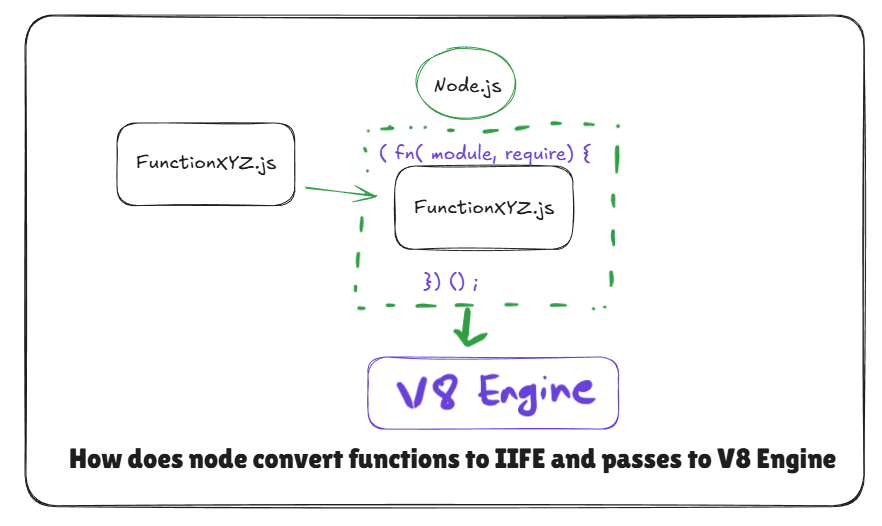

# Diving into the Node.js GitHub Repository

- Every module, behind the scenes, is wrapped inside a function.\
  That's why even without exporting, variables remain scoped to the
  module.

- Example usage of `require`:

  ```js
  // require("./path")
  ```

- The function that Node.js creates for each module is an **IIFE**
  (Immediately Invoked Function Expression).

- **IIFE**: A function that gets invoked as soon as it is created.

### This is how Node.js internally wraps a module:

```js
(function () {
  // All code of the module goes here
})();
```

# How are variables and functions private in different modules?

**Q:** How are variables and functions private in different modules?  
**Ans:** IIFE & `require`

`module` and `require` are provided by Node. They are parameters passed into the IIFE wrapper function.



---

## What happens when you do `require('/path')`?

1. **Resolving the module**
2. **Loading the module**
3. **Wrapping inside an IIFE**
4. **Evaluation → `module.exports`**
5. **Caching**
   - When a module is required multiple times, Node caches it during the first load and uses the cached version instead of repeating the first four steps.

---

### Node.js Internal Implementation

You can find the exact implementation of how Node does this in the Node.js repository:

https://github.com/nodejs/node/blob/main/lib/internal/modules/cjs/loader.js
