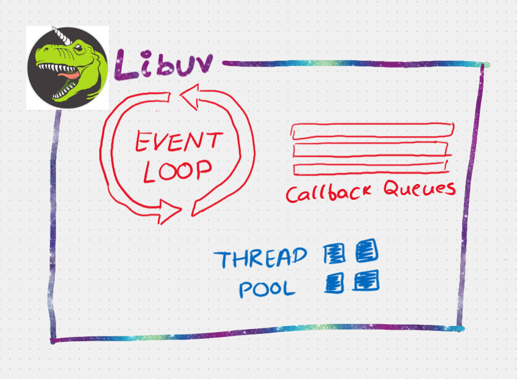
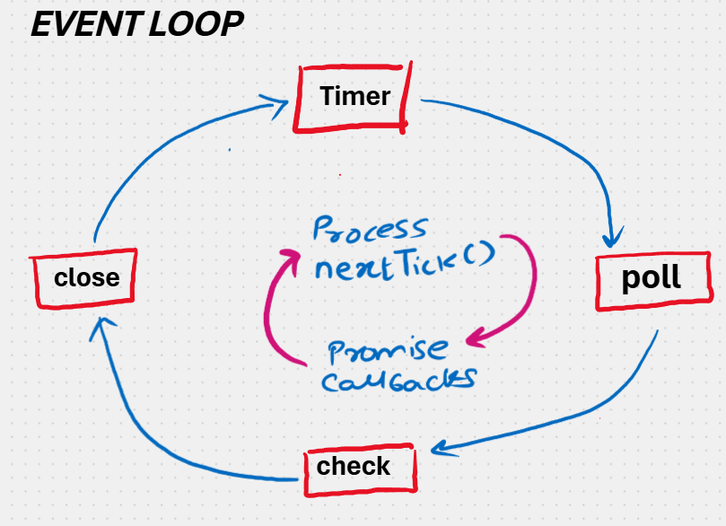

# libuv

When **libuv** finishes reading a file, it is libuv's responsibility to send back the **callback function**, and JavaScript executes it.

If the **V8 JS Engine** is busy, the callback waits in the **Callback Queue**, which is maintained by libuv.

---

## Event Loop

The **Event Loop** keeps checking the **Callback Queue** and the **V8 Engine**.

As soon as the V8 engine is free, the event loop sends the callback to the **Call Stack** for execution.

