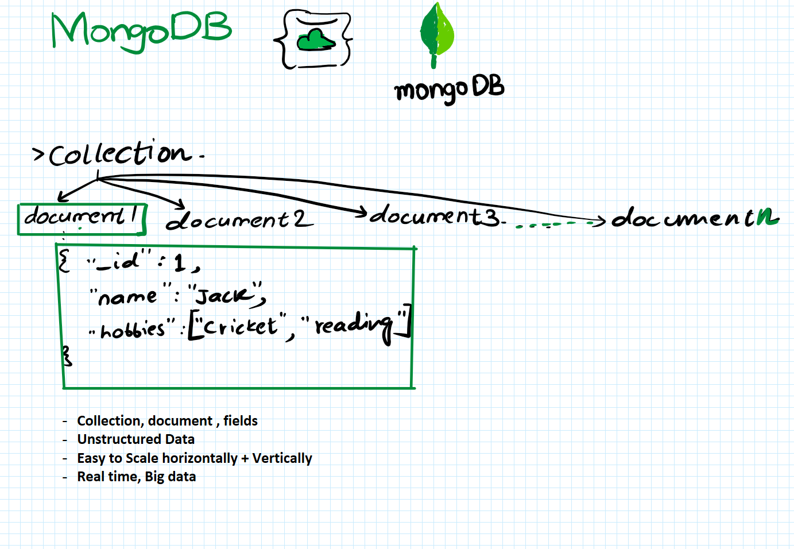

# NoSQL Databases

**NoSQL** stands for **Not Only SQL**.  
These databases are designed to handle large-scale, flexible, and unstructured data.

## Types of NoSQL Databases

- **Document Database (DocumentDB)**
- **Key-Value Database**
- **Graph Database**
- **Wide Column Database**

## Example

- **MongoDB** → Document Database
